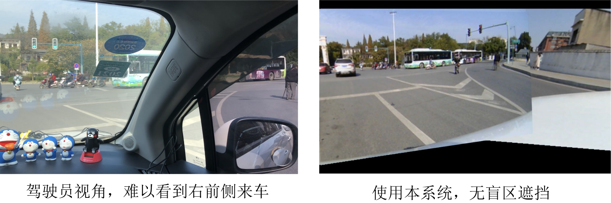
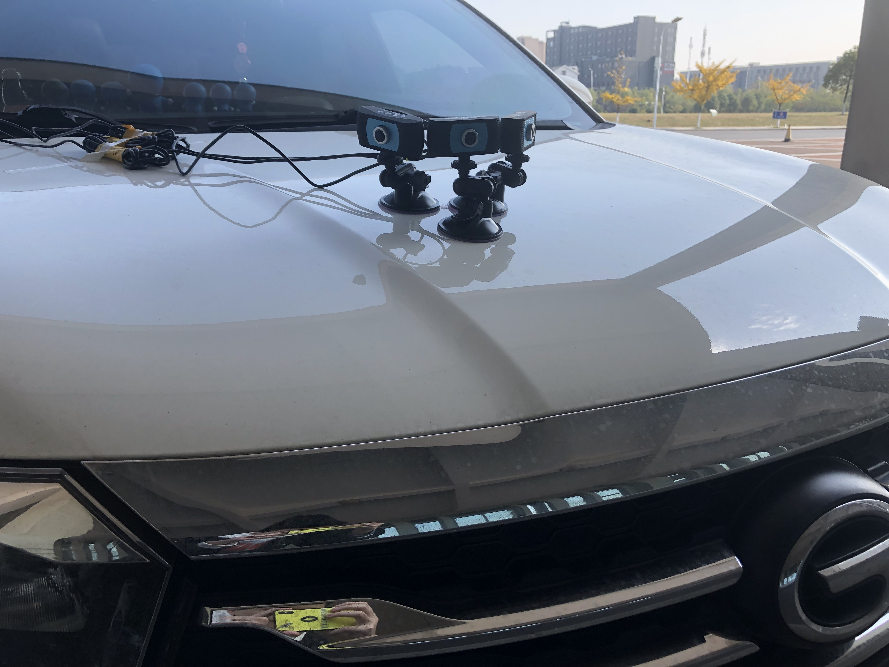
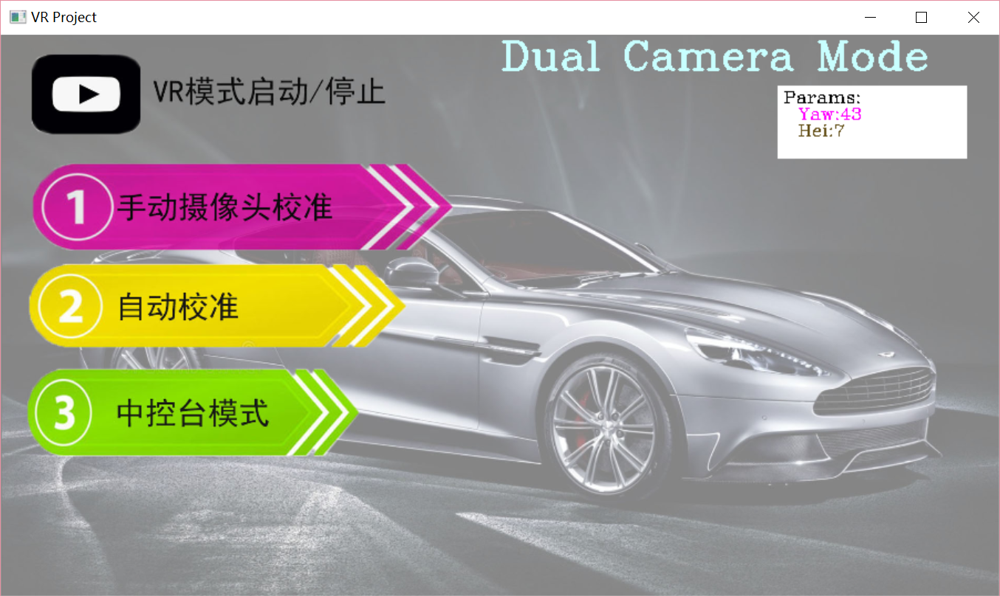
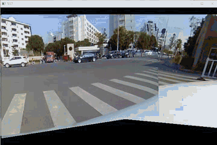
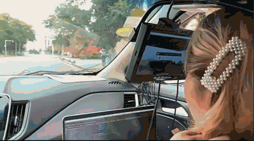
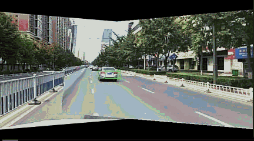

# 基于图像透视变化的车辆全景驾驶系统

## 1. 项目概述：

车辆 A 柱盲区和侧方盲区常常会给行车带来巨大安全隐患，而现有盲区解决方案大多以第三视角合成显示，因为畸变过大和视角过小的原因难以在行车过程中使用。本项目将利用摄像头和图像处理方法，对车辆盲区部分以第一视角进行重现显示。首先在车辆外部安装一组摄像头，之后利用标定板得到相机内参，而后基于参数计算求得透视变换矩阵，对采集到的图像根据驾驶员视角做透视变换处理，最后利用全景合成算法拼接成一副全景图，借助显示设备将一副没有盲区的画面实时显示给驾驶员。 实验结果表明，本文提出的方法能够有效消除车辆 A 柱及侧方盲区，且适合于行车过程中使用，并且处理速度满足实时性要求。

## 2. 代码说明

#### 0. 准备工作

​	本程序是按照视频流所设计的，所以在使用前请保证插入了3路/2路USB摄像头。不过也可以更改为图片模式用于调试，不过需要指定图片路径。之后进入VR_project 或 VR_project_dual 文件夹运行 “UI.py” 文件即可。

#### 1. 摄像头安装

​	摄像头需要按照图示的方法安装，将三个摄像头朝向不同方向但保证相邻两相机拍摄画面有重叠，因为需要使用SURF配对来校正拼接，同时透视变化后的图片容易在边角处缺失图片信息，所以保证较大的重叠可以满足较好的系统输出效果。

#### 3. UI界面使用

​	UI界面分为校准和使用两部分，在摄像头第一次安装后首先需要校准在使用。

* VR模式：配合VR眼镜使用，VR眼镜收集头部姿态信息，然后控制算法生成对应方向的画面并返回至VR或AR眼镜中。

* 中控台模式：显示屏是嵌入在中控台上的，通过遥感控制观察方向。

* 手动摄像头校准：通过bar来调整摄像头姿态参数（外参），并通过实时生成的全景图判断参数是否准确

* 自动校准：通过SIFT/SURF提取特征点并匹配来进行摄像头参数估计

## 3. 成果展示

1. 生成画面显示：

2. 配合可穿戴眼镜（显示屏）的效果

3. 配合YOLO检测可以在显示屏中标记出距离较近的车辆，提醒司机注意

